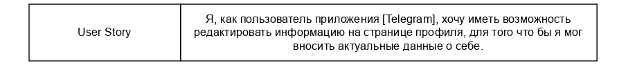
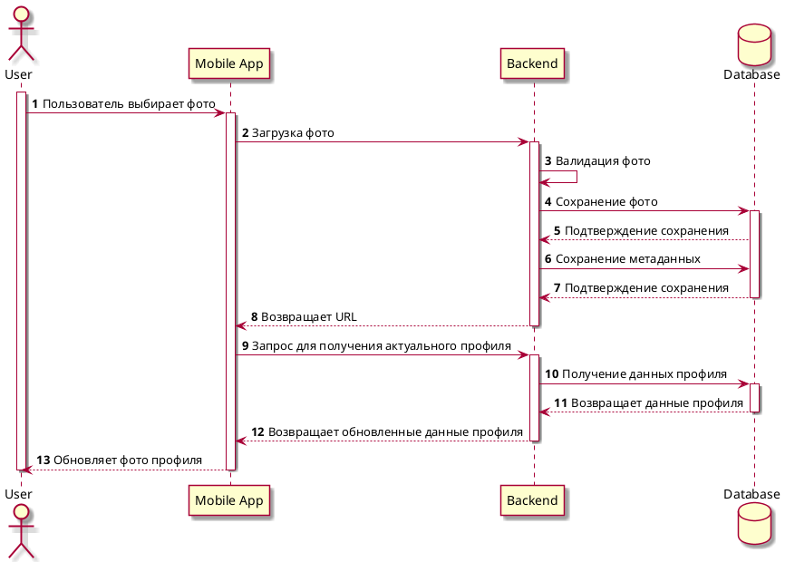

# **project_SA**

## US 
<details>
<summary>Выполнение задания</summary>

User story (пользовательская история) — это простой и короткий текст, который описывает
потребности и ожидания заказчика от продукта или услуги. Основная цель —понять, что именно
нужно создать, чтобы удовлетворить потребности конечного пользователя.

`Шаблон: "Я, как [роль], хочу иметь [возможность] для того чтобы [цель]".`
    
 
</details>

## Макеты
<details>
<summary>Выполнение задания</summary>

Макеты или прототипы системы нужны для того, чтобы дизайнер мог понять, что именно ему
необходимо изобразить, а также для того, чтобы понять пользовательский путь. В макете должно
быть схематично отображен будущий интерфейс со всеми основными элементами

- отрисовка в draw.io
- не более 5 макетов
- только основной сценарий

.jpg) 
</details>

## UC
<details>
<summary>Выполнение задания</summary>
    
Use case (вариант использования) — это описание того, как пользователь взаимодействует с
системой, чтобы достичь определенной цели. Варианты использования помогают понять
требования к системе и то, как она будет работать в разных сценариях.
    
В соответствии с Use Story и созданными макетами, необходимо составить Use Case в формате таблицы
Количество альтернативных/исключительных сценариев от 1 до 5

.jpg) 
</details>

## Architecture
<details>
<summary>Выполнение задания</summary>
    
Трёхуровневая архитектура
    
Фронтенд – это схематичный веб или мобильное приложение системы. Также фронтенд
называют клиентом
Бэкенд – это внутренний сервер системы проекта. Сервер обращается к базе данных с
полученными данными от клиента (фронтенда)
База данных – это хранилище данных, с которыми будет работать сервер

.jpg) 
</details>

## Data modeling
<details>
<summary>Выполнение задания</summary>

Модель данных – это представление данных, атрибутного состава сущностей, как сущности
связаны друг с другом. 

.jpg) 
</details>

## ERD
<details>
<summary>Выполнение задания</summary>

ERD-диаграмма — диаграмма где показано, как разные «сущности» (люди, объекты,
концепции и так далее) связаны между собой внутри системы. 

Задание: 
Сделать ER-диаграмму для своего проекта: 
- Отображены все сущности 
- Описаны атрибуты сущностей 
- Указаны типы данных сущностей 
- Отображены связи между сущностями 
- Указаны типы связей в нотации "воронья лапка" 
- Указаны РК (первичные ключи) и FK (внешние ключи)

Ограничения: 
1. Объем описываемых сущностей определен в занятии "модели данных" 
2. Сущности на английском языке в множественном числе 
3. Атрибуты на английском языке в единственном числе 
4. Для именования сущностей и атрибутов только строчные буквы и символ подчеркивания "_" 
5. Запрещено использовать "id" в качестве атрибута. Можно использовать постфикс "_id" 
6. Допустимые типы данных: INT, DECIMAL, VARCHAR, TEXT, BOOL, DATE, TIMESTAMPZ 
7. В крайних случаях возможно согласование экспертом использование дополнительных типов данных из документации PostgreSQL 
8. Не указываем ограничения для типов данных, например VARCHAR (255) писать не надо, только VARCHAR 
9. Не больше одного РК на сущность 
10. Формат сдачи файлы.drawio и.pdf 

```SQL
CREATE TABLE users(
    user_id SERIAL PRIMARY KEY,
    user_first_name VARCHAR(100),
    user_last_name VARCHAR(100),
    patronymic VARCHAR(100)
);
CREATE TYPE status_enum AS ENUM ('В сети', 'Отошел', 'Занят');
CREATE TABLE profiles(
    profile_id SERIAL PRIMARY KEY,
    user_id INT NOT NULL,
    birth_date DATE,
    status status_enum DEFAULT 'Отошел',
    CONSTRAINT fk_profiles_users FOREIGN KEY (user_id) REFERENCES users(user_id) ON DELETE CASCADE 
);
CREATE TABLE photos(
    photo_id SERIAL PRIMARY KEY,
    profile_id INT NOT NULL,
    name VARCHAR(100),
    size DECIMAL,
    pixels VARCHAR(100),
    format VARCHAR(100),
    route VARCHAR(100),
    date_of_creation TIMESTAMP WITH TIME ZONE,
    CONSTRAINT fk_photos_profiles FOREIGN KEY (profile_id) REFERENCES profiles(profile_id) ON DELETE CASCADE
);
INSERT INTO users(user_first_name, user_last_name, patronymic ) 
VALUES
('Андрей', 'Журавлёв', 'Александрович'),
('Кристина', 'Тихонова', 'Владимировна'),
('Евгения', 'Никитенкова', 'Ивановна');
INSERT INTO profiles(user_id, birth_date, status) 
VALUES
(1, '1992-10-07', 'В сети'),
(2, '1995-03-30', 'Отошел'),
(3, '1994-06-15', 'Занят');
INSERT INTO photos(profile_id, name, size, pixels, format, route, date_of_creation) 
VALUES
(1, '123', 12, '1795x2551', 'PNG', 'C:/Documents/', '2024-11-14'),
(2, '456', 13, '1795x2551', 'PNG', 'C:/Documents/', '2024-11-14'),
(3, '789', 11, '1795x2551', 'SVG', 'C:/Documents/', '2024-11-14');
SELECT user_first_name AS Имя, user_last_name AS Фамилия, patronymic AS Отчество, birth_date AS Дата_рождения, status AS Статус, name AS Название_файла, size AS Размер_в_МБ, pixels AS Разрешение,format AS Формат_файла, route AS Расположение_файла, date_of_creation AS Дата_создания
FROM users
JOIN profiles ON users.user_id = profiles.user_id
JOIN photos ON profiles.profile_id = photos.profile_id

drop TABLE users,profiles, photos;
drop TYPE status_enum
```
.jpg) 
</details>

## Sequence
<details>
<summary>Выполнение задания</summary>

1. Построить sequence-диаграмму с использованием PlantUML.
2. Составить сопроводительную таблицу, поясняющую взаимодействия/вызовы/стрелки, указанные на диаграмме. Пример брать из шаблона ФТ.

Требования
1. Только основной положительный сценарий (никаких альтернативных). Остановитесь на ОДНОЙ END2END цепи вызовов.
2. Только синхронные запросы.
3. Только трехзвенная архитектура.



.jpg) 
</details>

## LLM-Gigachat
<details>
<summary>Выполнение задания</summary>
На языке Python с использованием любых библиотек написать скрипт, который шлет в апи гигачата системный и пользовательский промпты (на свободную тему). Результат ответа от гигачата необходимо вывести в консоль (терминал).

 

### Запуск скрипта с использованием GigaChat API

#### Шаг 1: Установка необходимых библиотек

Для работы скрипта вам потребуется установить несколько Python-библиотек. Если у вас еще нет установленных `langchain` и `getpass`, выполните следующую команду в терминале:

```bash
pip install langchain
pip install getpass
```

#### Шаг 2: Получение токена доступа

Чтобы использовать GigaChat API, вам понадобится токен доступа (`Authorization key`). Если вы еще не получили его, обратитесь к документации платформы, где вы используете GigaChat, чтобы узнать, как получить этот ключ.

#### Шаг 3: Сохранение токена в переменной окружения

После получения токена сохраните его в переменную окружения `GIGACHAT_TOKEN`. Это можно сделать следующим образом:

1. Откройте терминал и введите следующую команду:
   
   ```bash
   export GIGACHAT_TOKEN='ваш_токен'
   ```

   Убедитесь, что вместо `ваш_токен` подставили свой реальный токен.

2. Для проверки, что токен был сохранён правильно, выполните команду:

   ```bash
   echo $GIGACHAT_TOKEN
   ```

   Вы должны увидеть ваш токен в выводе команды.

#### Шаг 4: Запуск скрипта

Теперь, когда все готово, запустите скрипт:

 Запустите скрипт следующей командой:

   ```bash
   python LLM.py
   ```

#### Шаг 5: Ввод данных

Когда скрипт запустится, он запросит у вас ввод Use case. Введите интересующий вас сценарий и нажмите Enter. Скрипт отправит запрос в GigaChat и выведет ответ. 
</details>

## Документация REST API в табличном виде
<details>
<summary>Выполнение задания</summary>

1. Ознакомится с типами, использующимися в json объектах тут: 
https://www.json.org/json-en.html 
2. Создать PDF файл по описанию своего/своих спроектированных методов. Пример брать из Шаблона ФТ. В приложенном файле текстом описать какую бизнес логику реализует вызов (например, создает сущность "кот" в системе).
3. Минимум один REST вызов, максимум два REST вызова.

Требования
1. Только положительный успешный вызов/вызовы. Никаких эдж кейсов. В вызове всё идёт хорошо, вызов не ломается. 
2. Можно использовать GET И/ИЛИ POST. Брать другие типы вызовов нельзя. 

.jpg) 
</details>

## Swagger
<details>
<summary>Выполнение задания</summary>
Взять свои методы, спроектированные в табличной форме и положить их в формат сваггера. 
- больше 2х методов делать нельзя. 
- методы только GET или POST.
- только положительный успешный вызов/вызовы. Никаких эдж кейсов. В вызове всё идёт хорошо, вызов не ломается. 

```yaml
openapi: 3.0.3
info:
  title: Swagger
  description: Описание методов API для загрузки фотографии на сервер
  version: 1.0.12
servers:
  - url: https://telegram.com/api/v1
tags:
  - name: avatar
    description: Метод для работы с фотографиями
paths:
  /users/{userId}/avatar:
    post:
      tags:
        - avatar
      summary: Загрузить аватар пользователя
      description: Загружает аватар для указанного пользователя
      parameters:
        - in: path
          name: userId
          required: true
          schema:
            type: integer
          description: Идентификатор пользователя
      requestBody:
        content:
          multipart/form-data:
            schema:
              $ref: '#/components/schemas/AvatarFile'
      responses:
        '201':
          description: Аватар успешно загружен
          content:
            application/json:
              schema:
                $ref: '#/components/schemas/AvatarUploadResponse'
        '400':
          description: Неправильный формат файла
          content:
            application/json:
              schema:
                $ref: '#/components/schemas/ErrorResponse'
        '413':
          description: Превышен допустимый размер файла
          content:
            application/json:
              schema:
                $ref: '#/components/schemas/ErrorResponse'
        '415':
          description: Неподдерживаемый MIME-тип файла
          content:
            application/json:
              schema:
                $ref: '#/components/schemas/ErrorResponse'
        '500':
          description: Внутренняя ошибка сервера
          content:
            application/json:
              schema:
                $ref: '#/components/schemas/ErrorResponse'
components:
  schemas:
    AvatarFile:
      type: object
      properties:
        avatar:
          type: string
          format: binary
          description: Изображение (файл фотографии)
          maxLength: 20971520  # Максимальный размер файла 20 МБ
          minLength: 512      # Минимальный размер файла 512 байт
          pattern: '^data:image/(png|jpeg|svg\+xml);base64,[a-zA-Z0-9+/=]*$'  # Проверяем, что файл имеет правильный MIME-тип
      required:
        - avatar
    AvatarUploadResponse:
      type: object
      properties:
        message:
          type: string
          description: Сообщение о результате выполнения операции
          example: "Аватар успешно загружен"
        userId:
          type: integer
          description: Идентификатор пользователя, для которого был загружен аватар
          example: 42
        avatarUrl:
          type: string
          description: Ссылка на загруженный аватар
          example: "https://example.com/avatars/user_42.png"
        timestamp:
          type: string
          description: Время загрузки аватара в формате ISO 8601
          example: "2023-09-01T15:30:00Z"
        filename:
          type: string
          description: Исходное имя файла
          example: "profile_pic.jpg"
        sizeMb:
          type: number
          format: double
          description: Размер загруженного файла в мегабайтах
          example: 2.5
        mimeType:
          type: string
          description: MIME-тип загруженного файла
          example: "image/jpeg"
      required:
        - message
        - userId
        - avatarUrl
        - timestamp
        - filename
        - sizeMb
        - mimeType
    ErrorResponse:
      type: object
      properties:
        Code:
          type: number
          description: Код ошибки
          example: 400
        Message:
          type: string
          description: Подробное сообщение об ошибке
          example: "Неправильный формат файла"
      required:
        - Code
        - Message
```
</details>

## AC + NFR
<details>
<summary>Выполнение задания</summary>

КП
 - Кейсы в рамках ваших фичей, связаны с US, UC и макетами
 - Кейсы не должны включать в себя основной сценарий
 - Описать от 2 до 4 кейсов включительно

 .jpg)
 .jpg)
</details>
